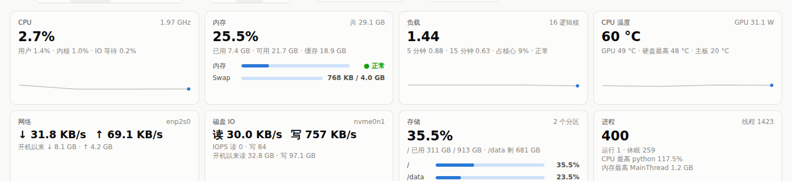

# glances-dashboard

A single-file, dependency-free web dashboard for one Linux host, built on top of the
[Glances](https://github.com/nicolargo/glances) REST API. Open it from any browser on
your LAN to see CPU, memory, load, temperatures, network, disk I/O, storage and the full
process list, with live charts and in-browser history (up to one hour).



## What you get

- **Stat tiles**: CPU, memory + swap, load, CPU/GPU/board temperature, network, disk I/O,
  storage, processes (with the current top CPU and top memory process).
- **Live charts**: CPU stacked by user/system/iowait, per-core columns, memory/swap,
  network throughput, disk I/O, load averages, and temperatures grouped by device
  (CPU/GPU/board, one chart per NVMe drive with composite/controller/NAND sensors).
- **Hardware temperature table**: every hwmon sensor, named by device model, with
  warning/critical thresholds and a distance-to-critical meter.
- **Process table**: sortable, filterable, optional aggregation by program.
- Crosshair tooltips on every chart, a data-table view per chart, light/dark theme.

Why a sidecar (`serve.py`) instead of plain static hosting: Glances labels temperature
sensors by hwmon index ("Composite", "Composite 1"), which does not identify the device
and can change across reboots. `serve.py` reads `/sys/class/hwmon` directly and names
sensors by hardware (CPU model, GPU, NVMe model) and exposes them at `/sensors.json`.

## Requirements

- Linux with `/sys/class/hwmon` (temperatures are optional; everything else works without).
- Python 3.10+ (standard library only).
- Glances 4.x with the web extra, running with its API reachable from the dashboard host.
  No root required for any of this.

## Install

```sh
# 1. Glances API (user-level, no root)
uv tool install 'glances[web]'      # or: pipx install 'glances[web]'

# 2. Dashboard files
git clone https://github.com/qihan-bot/glances-dashboard ~/monitor

# 3. User-level systemd services (survive reboots if lingering is enabled)
mkdir -p ~/.config/systemd/user
cp ~/monitor/systemd/*.service ~/.config/systemd/user/
systemctl --user daemon-reload
systemctl --user enable --now glances-web.service monitor-web.service
loginctl enable-linger "$USER"      # may need sudo once
```

Then open `http://<host>:61209/`. The page fetches `http://<same host>:61208/api/4/all`
from Glances and `/sensors.json` from `serve.py`.

Ports: Glances on **61208**, dashboard on **61209**. Change them in the two unit files and
in the `API` constant at the top of the `<script>` in `index.html`.

## Security

Both services bind to `0.0.0.0` with no authentication. Run this only on a trusted LAN or
behind a VPN such as Tailscale. To add a password to Glances, run `glances -w --password`
once and adjust the unit file.

## Design notes

Chart forms, mark specs and colours follow a small data-viz method: thin 2 px lines with a
10 % area wash, hairline grids, a fixed categorical palette validated for colour-vision
deficiency (blue, orange, aqua, yellow), status colours reserved for thresholds and always
paired with a label, one y-axis per chart, and a table view behind every chart.

## License

MIT
